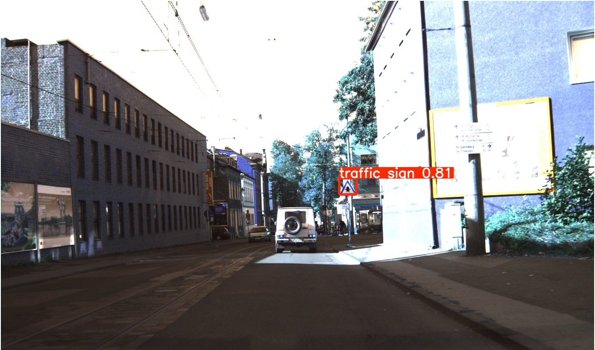
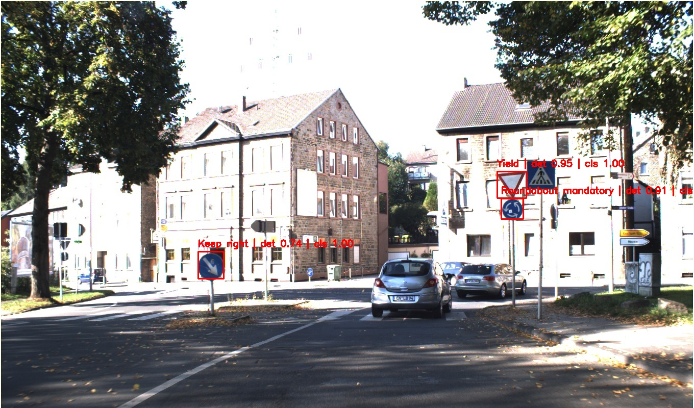
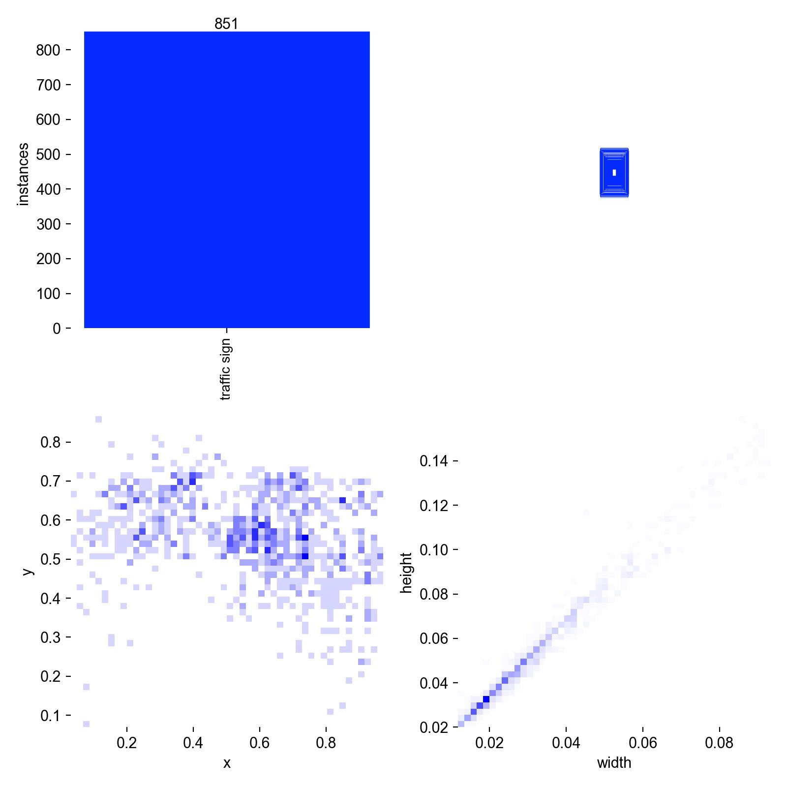
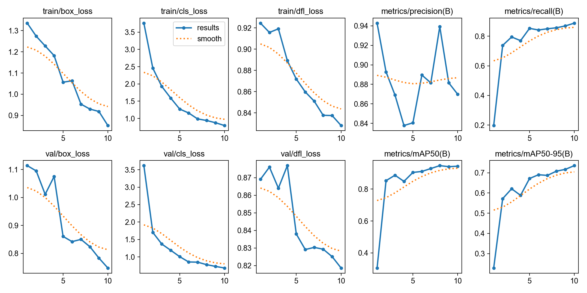

# RoadSign Vision: Traffic Sign Detection and Recognition

RoadSign Vision is an end-to-end computer vision project for detecting and recognizing traffic signs in full road images.

The project combines:

1. **YOLOv8** for traffic sign detection.
2. **ResNet-18** for traffic sign recognition/classification.
3. **Streamlit** for an interactive demo application.

Unlike a simple classifier that requires a cropped traffic sign image, this system works on full road images and automatically finds traffic signs before recognizing them.

---

## Project Overview

Traffic sign recognition is an important component of driver-assistance and autonomous driving systems.

This project follows a two-stage pipeline:

```text
Full road image
→ YOLO detects traffic sign locations
→ Detected signs are cropped
→ ResNet-18 classifies each crop
→ Final image displays bounding boxes, labels, and confidence scores
```

---

## Demo

The project includes a Streamlit app.

The app allows users to:

- Upload a road image
- Detect traffic signs
- View bounding boxes
- Recognize the exact traffic sign class
- Display detection confidence
- Display recognition confidence
- Show top-3 classification predictions

Run the app with:

```bash
streamlit run app/streamlit_app.py
```

---

## Example Output

The system outputs an annotated road image with labels such as:

```text
Speed limit 50 km/h | det 0.91 | cls 0.98
```

Where:

- `det` = YOLO detection confidence
- `cls` = ResNet recognition confidence

---

## Dataset

This project uses the **German Traffic Sign Detection Benchmark**, also known as **GTSDB**, for detection.

The dataset contains full road images with bounding box annotations around traffic signs.

After preprocessing, the dataset is converted into YOLO format.

### Dataset Summary

| Item | Count |
|---|---:|
| Total images | 900 |
| Training images | 600 |
| Validation images | 300 |
| Traffic sign bounding boxes | 1,213 |
| Detection classes | 1 |

For the YOLO detector, all traffic sign categories are converted into one class:

```text
traffic sign
```

The exact traffic sign type is predicted later by the ResNet-18 classifier.

---

## Why One Detection Class?

Originally, traffic signs have many different classes such as stop, yield, speed limit, and warning signs.

However, the detection dataset is relatively small. Training YOLO to detect 43 separate classes from only 900 images is difficult.

Instead, this project uses a stronger two-stage approach:

```text
YOLO detector:
Find where traffic signs are.

ResNet classifier:
Recognize what each detected sign means.
```

This makes the system more reliable and easier to train.

---

## Processed Dataset Format

The dataset is converted into YOLO format:

```text
data/processed/
│
├── images/
│   ├── train/
│   └── val/
│
├── labels/
│   ├── train/
│   └── val/
│
└── data.yaml
```

Each YOLO label file uses:

```text
class_id x_center y_center width height
```

All bounding box coordinates are normalized between `0` and `1`.

---

## Models

### 1. Detection Model

The detection model is:

```text
YOLOv8 Nano
```

It is fine-tuned on the processed GTSDB dataset.

The trained detector is saved locally at:

```text
models/yolo_gtsdb/weights/best.pt
```

### 2. Recognition Model

The recognition model is:

```text
ResNet-18
```

It was fine-tuned on cropped traffic sign images from the GTSRB classification dataset.

The trained classifier is saved locally at:

```text
models/best_resnet18_gtsrb.pth
```

Model files are not uploaded to GitHub because they are large.

---

## Results

### YOLO Detection Results

The YOLO detector was trained for 10 epochs.

Final validation performance:

| Metric | Result |
|---|---:|
| Precision | 87.0% |
| Recall | 88.9% |
| mAP50 | 94.3% |
| mAP50-95 | 73.5% |

These results show that the detector can locate most traffic signs in full road images with strong bounding-box quality.

---
---

## Visual Results

### YOLO Detection Result

The YOLO detector identifies traffic signs in full road images and draws bounding boxes around them.



---

### Detection + Recognition Result

The full pipeline detects the sign, crops it, classifies it using the ResNet-18 recognizer, and displays the predicted traffic sign class.



---
### Dataset Label Distribution




### Training Curves

YOLO training performance over 10 epochs.



## Project Pipeline

```text
1. Download GTSDB dataset
2. Extract raw road images and annotations
3. Convert annotations into YOLO format
4. Train YOLOv8 detector
5. Detect traffic signs in full road images
6. Crop detected sign regions
7. Classify crops using ResNet-18
8. Draw bounding boxes and predicted labels
9. Display results in Streamlit
```

---

## Project Structure

```text
roadsign-vision-detection-recognition/
│
├── app/
│   └── streamlit_app.py
│
├── configs/
│   └── config.yaml
│
├── data/
│   └── README.md
│
├── docs/
│   ├── DATASET.md
│   ├── MODEL_CARD.md
│   └── PIPELINE.md
│
├── models/
│   └── README.md
│
├── notebooks/
│   └── .gitkeep
│
├── reports/
│   └── figures/
│
├── src/
│   ├── prepare_dataset.py
│   ├── train_detector.py
│   ├── detect.py
│   ├── recognize.py
│   ├── pipeline.py
│   └── utils.py
│
├── tests/
│   └── test_pipeline.py
│
├── requirements.txt
├── README.md
├── .gitignore
└── LICENSE
```

---

## Installation

Clone the repository:

```bash
git clone https://github.com/hadimss/roadsign-vision-detection-recognition.git
cd roadsign-vision-detection-recognition
```

Create a virtual environment:

```bash
python3 -m venv .venv
source .venv/bin/activate
```

Install dependencies:

```bash
pip install -r requirements.txt
```

---

## Dataset Preparation

The raw GTSDB dataset should be placed in:

```text
data/raw/
```

After downloading and extracting the dataset, prepare it for YOLO training:

```bash
python3 src/prepare_dataset.py
```

This creates:

```text
data/processed/images/train/
data/processed/images/val/
data/processed/labels/train/
data/processed/labels/val/
data/processed/data.yaml
```

---

## Training the Detector

Train YOLOv8 on the processed dataset:

```bash
python3 src/train_detector.py
```

The best model is saved locally at:

```text
models/yolo_gtsdb/weights/best.pt
```

---

## Running Detection Only

To test only the YOLO detector:

```bash
python3 src/detect.py
```

This saves an annotated detection result to:

```text
reports/figures/detection_result.jpg
```

---

## Running Detection + Recognition

To run the full pipeline:

```bash
python3 src/pipeline.py --image data/processed/images/train/00000.jpg
```

The output is saved to:

```text
reports/figures/detection_recognition_result.jpg
```

---

## Running the Streamlit App

Start the application:

```bash
streamlit run app/streamlit_app.py
```

Then upload a road image.

The app will display:

- the original image
- the annotated result image
- detected traffic sign crops
- recognized sign classes
- detection confidence
- recognition confidence
- top-3 recognition predictions

---

## Required Local Model Files

This project requires two local model files:

```text
models/yolo_gtsdb/weights/best.pt
models/best_resnet18_gtsrb.pth
```

These files are ignored by Git and are not uploaded to GitHub.

To copy the ResNet classifier from the related classification project:

```bash
cp /Users/hadialmasri/traffic-sign-recognition-gtsrb/models/best_resnet18_gtsrb.pth models/best_resnet18_gtsrb.pth
```

---

## Technologies Used

- Python
- PyTorch
- TorchVision
- Ultralytics YOLO
- OpenCV
- Pillow
- NumPy
- Pandas
- Matplotlib
- Streamlit

---

## Development Roadmap

- [x] Create project structure
- [x] Add dataset preparation script
- [x] Convert GTSDB annotations to YOLO format
- [x] Train YOLO detector
- [x] Run detection inference
- [x] Add ResNet-18 recognition module
- [x] Build detection + recognition pipeline
- [x] Build Streamlit demo app
- [ ] Add more example result images
- [ ] Add video or webcam inference
- [ ] Deploy the Streamlit app online

---

## Limitations

This project is intended for educational and research purposes.

Current limitations:

- The detector was trained on a relatively small dataset.
- The dataset is based on German traffic signs.
- Performance may decrease in unseen countries or unusual road environments.
- Poor lighting, motion blur, or occlusion may reduce accuracy.
- The system should not be used for real-world safety-critical driving decisions.

---

## Future Improvements

- Train on a larger and more diverse traffic sign detection dataset.
- Compare YOLOv8 Nano with YOLOv8 Small or YOLOv8 Medium.
- Add real-time webcam inference.
- Add video file inference.
- Deploy the Streamlit app online.
- Export the detector to ONNX for lightweight deployment.
- Improve recognition using ConvNeXt or Vision Transformer models.

---

## Related Project

This project extends a traffic sign classification project based on ResNet-18 and GTSRB.

The classification project focuses on:

```text
cropped traffic sign image → exact traffic sign class
```

This project focuses on:

```text
full road image → detect sign → crop sign → recognize class
```

---

## Author

**Hadi Al Masri**